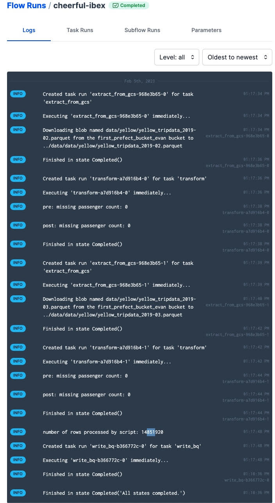

Q1) From modifying the 'etl_web_to_gcs.py' file with the suggested perameters, we find the correct answer is 447,770 rows

``` python

from pathlib import Path
import pandas as pd
from prefect import flow, task
from prefect_gcp.cloud_storage import GcsBucket
from random import randint


@task(retries=3)
def fetch(dataset_url: str) -> pd.DataFrame:
    """Read taxi data from web into pandas DataFrame"""
    # if randint(0, 1) > 0:
    #     raise Exception

    df = pd.read_csv(dataset_url)
    return df


@task(log_prints=True)
def clean(df: pd.DataFrame, color) -> pd.DataFrame:
    """Fix dtype issues"""

    if color == 'yellow':
        df["tpep_pickup_datetime"] = pd.to_datetime(df["tpep_pickup_datetime"])
        df["tpep_dropoff_datetime"] = pd.to_datetime(df["tpep_dropoff_datetime"])
    elif color == 'green':
        df["lpep_pickup_datetime"] = pd.to_datetime(df["lpep_pickup_datetime"])
        df["lpep_dropoff_datetime"] = pd.to_datetime(df["lpep_dropoff_datetime"])
        
    print(df.head(2))
    print(f"columns: {df.dtypes}")
    print(f"rows: {len(df)}")
    return df


@task()
def write_local(df: pd.DataFrame, color: str, dataset_file: str) -> Path:
    """Write DataFrame out locally as parquet file"""
    path = Path(f"data/{color}/{dataset_file}.parquet")
    df.to_parquet(path, compression="gzip")
    return path


@task()
def write_gcs(path: Path) -> None:
    """Upload local parquet file to GCS"""
    gcs_block = GcsBucket.load("zoom-gcs")
    gcs_block.upload_from_path(from_path=path, to_path=path)
    return


@flow()
def etl_web_to_gcs() -> None:
    """The main ETL function"""
    color = "green"
    year = 2020
    month = 1
    dataset_file = f"{color}_tripdata_{year}-{month:02}"
    dataset_url = f"https://github.com/DataTalksClub/nyc-tlc-data/releases/download/{color}/{dataset_file}.csv.gz"

    df = fetch(dataset_url)
    df_clean = clean(df, color)
    path = write_local(df_clean, color, dataset_file)
    write_gcs(path)


if __name__ == "__main__":
    etl_web_to_gcs()


```

Q2) Applying these parameters to the CRON format, we can see '0 5 1 * *' is the correct answer. We can also double check our underderstanding with the the link below

<https://crontab.guru/#0_5_1_*_*/>


``` bash
prefect deployment build /flows/02_gcp/etl_web_to_gcs.py:etl_web_to_gcs -n etl2 --cron "0 5 1 * *" -a
```


Q3) For this question, we can parameterize the 'etl_gcs_to_bq.py' file, making sure to remove an transformation steps. The result of this shows 14,851,920 rows

``` python
from pathlib import Path
import pandas as pd
from prefect import flow, task
from prefect_gcp.cloud_storage import GcsBucket
from prefect_gcp import GcpCredentials


@task(retries=3)
def extract_from_gcs(color: str, year: int, month: int) -> Path:
    """Download trip data from GCS"""
    gcs_path = f"data/{color}/{color}_tripdata_{year}-{month:02}.parquet"
    gcs_block = GcsBucket.load("zoom-gcs")
    gcs_block.get_directory(from_path=gcs_path, local_path=f"../data/")
    return Path(f"../data/{gcs_path}")


@task()
def transform(path: Path) -> pd.DataFrame:
    """Data cleaning example"""
    df = pd.read_parquet(path)
    print(f"pre: missing passenger count: {df['passenger_count'].isna().sum()}")
    # df["passenger_count"].fillna(0, inplace=True)
    print(f"post: missing passenger count: {df['passenger_count'].isna().sum()}")
    return df


@task()
def write_bq(df: pd.DataFrame) -> None:
    """Write DataFrame to BiqQuery"""

    gcp_credentials_block = GcpCredentials.load("zoom-gcp-creds")

    df.to_gbq(
        destination_table="dezoomcamp.rides",
        project_id="ny-rides-evan",
        credentials=gcp_credentials_block.get_credentials_from_service_account(),
        chunksize=500_000,
        if_exists="append",
    )


@flow(log_prints=True)
def etl_gcs_to_bq(months: list[int] = [1, 2], year: int = 2021, color: str = "yellow"):
    """Main ETL flow to load data into Big Query"""
    # color = "yellow"
    # year = 2021
    # month = 1


    df = pd.DataFrame()
    for month in months:
        # etl_web_to_gcs(year, month, color)
        path = extract_from_gcs(color, year, month)
        # df = transform(path)
        df = df.append(transform(path))

    print(f'number of rows processed by script: {len(df)}')

    write_bq(df)


if __name__ == "__main__":
    color = "yellow"
    months = [2, 3]
    year = 2019

    etl_gcs_to_bq(months, year, color)
```




Q4) For this questions, we can again bootstrap from the 'etl_gcs_to_bq.py' file,

``` python
from pathlib import Path
import pandas as pd
from prefect import flow, task
from prefect_gcp.cloud_storage import GcsBucket
from random import randint


@task(retries=3)
def fetch(dataset_url: str) -> pd.DataFrame:
    """Read taxi data from web into pandas DataFrame"""
    # if randint(0, 1) > 0:
    #     raise Exception

    df = pd.read_csv(dataset_url)
    return df


@task(log_prints=True)
def clean(df: pd.DataFrame, color) -> pd.DataFrame:
    """Fix dtype issues"""

    if color == 'yellow':
        df["tpep_pickup_datetime"] = pd.to_datetime(df["tpep_pickup_datetime"])
        df["tpep_dropoff_datetime"] = pd.to_datetime(df["tpep_dropoff_datetime"])
    elif color == 'green':
        df["lpep_pickup_datetime"] = pd.to_datetime(df["lpep_pickup_datetime"])
        df["lpep_dropoff_datetime"] = pd.to_datetime(df["lpep_dropoff_datetime"])
        
    print(df.head(2))
    print(f"columns: {df.dtypes}")
    print(f"rows: {len(df)}")
    return df


@task()
def write_local(df: pd.DataFrame, color: str, dataset_file: str) -> Path:
    """Write DataFrame out locally as parquet file"""
    path = Path(f"data/{color}/{dataset_file}.parquet")
    df.to_parquet(path, compression="gzip")
    return path


@task()
def write_gcs(path: Path) -> None:
    """Upload local parquet file to GCS"""
    gcs_block = GcsBucket.load("zoom-gcs")
    gcs_block.upload_from_path(from_path=path, to_path=path)
    return


@flow(log_prints=True)
def etl_web_to_gcs() -> None:
    """The main ETL function"""
    color = "green"
    year = 2020
    month = 11
    dataset_file = f"{color}_tripdata_{year}-{month:02}"
    dataset_url = f"https://github.com/DataTalksClub/nyc-tlc-data/releases/download/{color}/{dataset_file}.csv.gz"

    df = fetch(dataset_url)
    df_clean = clean(df, color)

    print(f'number of rows processed by script before cleaning: {len(df)}')
    print(f'number of rows processed by script after cleaning: {len(df_clean)}')


    path = write_local(df_clean, color, dataset_file)
    write_gcs(path)


if __name__ == "__main__":
    etl_web_to_gcs()

```

We can then run the below bash command to point Prefect towards our ETL file:
``` python
prefect deployment build .week2/week2-homework/etl_web_to_gcs-homework-2-q4.py:etl_web_to_gcs -n "GitHub Storage Flow" -sb github/github-block -o web_to_gcs_github-deployment.yaml --apply 
prefect agent start -q 'default'
```


Q5) From the below code, we can see the correct answer is 514,392 rows

``` python

```

Q6) Following the instructions in the video, we can see our password is obfuscated with 8 '*'


