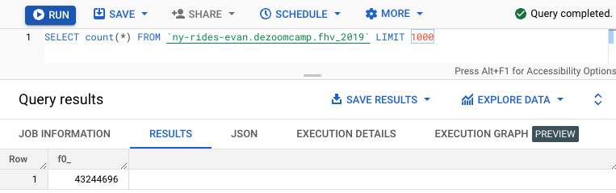
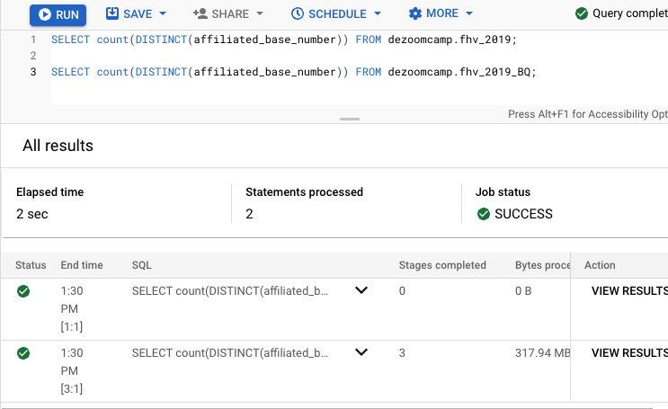
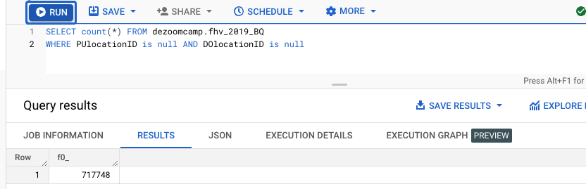
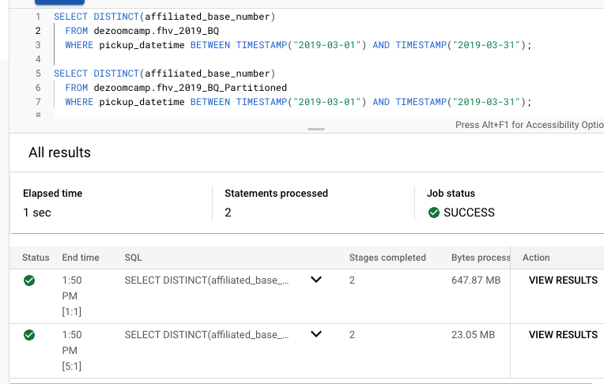

Q1) From running the below procedure/code we find the correct answer to be 43,244,696

[Q1. py file](web_to_gcs_hw3.py)

``` bash
CREATE OR REPLACE EXTERNAL TABLE dezoomcamp.fhv_2019
OPTIONS (
  format = 'PARQUET',
  uris = ['gs://first_prefect_bucket_evan/data/fhv_tripdata_2019-*.parquet']
);
```

``` bash
CREATE OR REPLACE TABLE dezoomcamp.fhv_2019_BQ
AS SELECT * FROM dezoomcamp.fhv_2019;
```



Q2) From running the below procedure/code we find the correct answer 0 MB external and 317.9 MB for the BQ table
``` bash
SELECT count(DISTINCT(affiliated_base_number)) FROM dezoomcamp.fhv_2019
```

``` bash
SELECT count(DISTINCT(affiliated_base_number)) FROM dezoomcamp.fhv_2019_BQ
```



Q3) From running the below procedure/code we find the correct answer 717,748

``` bash
SELECT count(*) FROM dezoomcamp.fhv_2019_BQ
WHERE PUlocationID is null AND DOlocationID is null
```



Q4) As mentioned in the material, the answer is 'Partition by pickup_datetime Cluster on affiliated_base_number'


Q5) From running the below procedure/code we find the correct answer 647.87 MB for non-partitioned and 23.06 MB for the partitioned table

To create a table partitioned by 'pickup_datetime' we can execute the below code
``` bash
CREATE OR REPLACE TABLE dezoomcamp.fhv_2019_BQ_Partitioned 
PARTITION BY DATE(pickup_datetime)
CLUSTER BY affiliated_base_number AS (
  SELECT * FROM dezoomcamp.fhv_2019_BQ
)
```

Now we can compare the performance between the partitioned and non-partitioned BQ tables
``` bash
SELECT DISTINCT(affiliated_base_number) 
  FROM dezoomcamp.fhv_2019_BQ 
  WHERE pickup_datetime BETWEEN TIMESTAMP("2019-03-01") AND TIMESTAMP("2019-03-31");

SELECT DISTINCT(affiliated_base_number) 
  FROM dezoomcamp.fhv_2019_BQ_Partitioned 
  WHERE pickup_datetime BETWEEN TIMESTAMP("2019-03-01") AND TIMESTAMP("2019-03-31");
```



Q6) As mentioned in the material, the answer is 'GCP Bucket'

Q7) As mentioned in the material, the answer is 'False'


