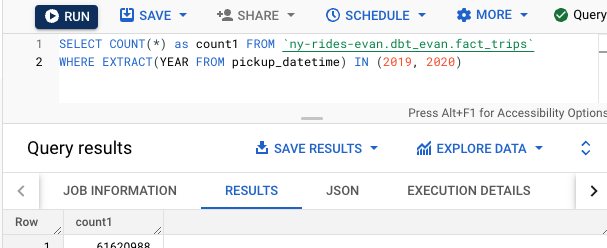
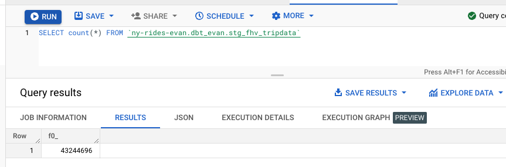
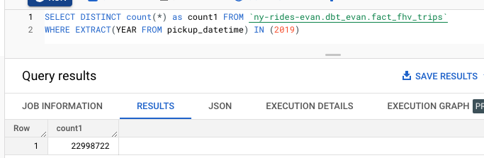

To answer these questions I needed to utilize the Prefect flow written for week 2:

[week-4-data-prep. py file](parameterized_flow-Homework-4-prep.py)

Q1) From running the below procedure/code we find the correct answer to be 61648442

``` bash
SELECT COUNT(*) FROM de-rides-375425.ny_rides_data.trips_fact
WHERE EXTRACT(YEAR FROM pickup_datetime) IN (2019, 2020)
```


Q2) We can utilize Google Data Studio - using a pie chart or table by pivoting on the service type field we find the answer to be 89.9/10.1

Q3) Here we create a staging model as shown in the lecture, and from running the below code find the correct answer to be 43244696


``` bash
select COUNT(*) FROM de-rides-375425.ny_rides_data.stg_fhv_rides 
WHERE EXTRACT(YEAR FROM pickup_datetime) IN (2019)
```


Q4) Again here if we follow this week's lecture on creating core models, from running the below SQL we find the answer to be 22998722

``` bash
SELECT COUNT(*) FROM de-rides-375425.ny_rides_data..fhv_trips_fact
WHERE EXTRACT(YEAR FROM pickup_datetime) IN (2019)
```


Q5) From running the below procedure/code we find the correct answer to be January

