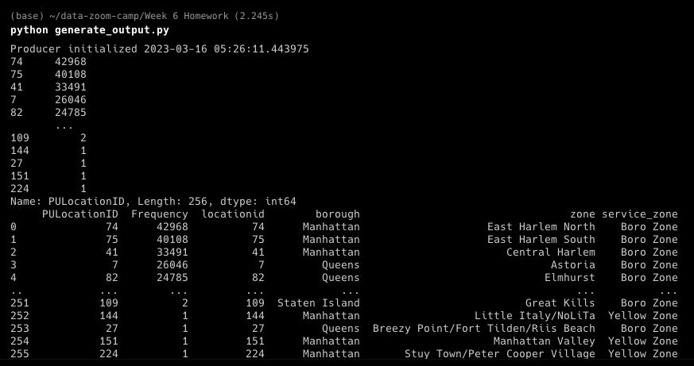

Q1) The correct answer is Kafka Node is responsible to store topics, Group-Id ensures the messages are distributed to associated consumers

Q2) The correct answer is Topic Replication, Ack All 

Q3) The correct answer is Topic Paritioning

Q4) The correct answer is payment_type, vendor_id

Q5) The correct answer is Deserializer Configuration, Bootstrap Server, Group-Id, Offset

Q6) We can use kafka-python instead of the java library as it's easier to follow the concepts and not get hung up on java syntax 

Producer:

[python-kafka_producer.py](python-kafka_producer.py)

Consumer:

[python-kafka_consumer.py](python-kafka_consumer.py)

Output:

